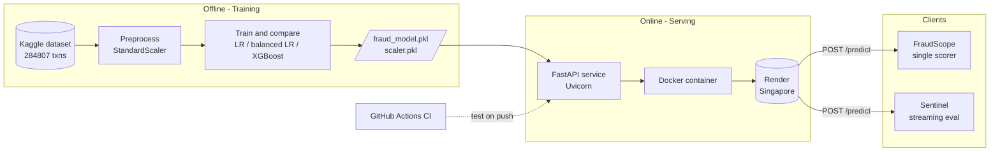
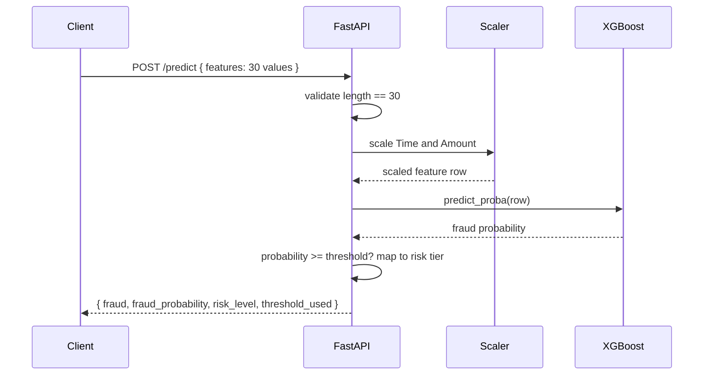
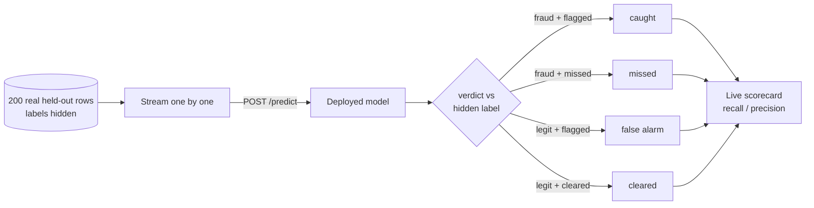

<div align="center">

# 🛡️ Fraud Detection — End-to-End ML System

**A credit-card fraud detection model, trained on 284,807 real transactions, served through a FastAPI REST API, containerized with Docker, deployed on Render, and demonstrated with two live front-ends — including a real-time evaluation that streams held-out transactions through the deployed model and scores its verdicts against ground truth.**

[](https://fraud-detection-api-5eog.onrender.com/docs)
[](https://fraud-detection-ui-y8ch.onrender.com/app.html)
[](#-the-model)
[](#-results)
[](#-results)

</div>

---

## 🔗 Live links

| What | URL |
|---|---|
| **Interactive API docs (Swagger)** | https://fraud-detection-api-5eog.onrender.com/docs |
| **FraudScope** — single-transaction scorer | https://fraud-detection-ui-y8ch.onrender.com |
| **Sentinel** — live streaming evaluation | https://fraud-detection-ui-y8ch.onrender.com/app.html |

> ⏱️ The API runs on Render's free tier and sleeps after inactivity — the first request may take ~30–50 seconds to wake. Subsequent requests are fast.

---

## 📌 What this project demonstrates

This isn't a notebook that ends at `model.fit()`. It's the full path from raw data to a running service that other software can call:

- **The modelling problem done honestly** — severe class imbalance (0.17% fraud), cost-sensitive evaluation, and a deliberate precision/recall trade-off rather than chasing accuracy.
- **The engineering around the model** — a typed REST API with input validation, risk-tier decisioning, batch scoring, containerization, and CI.
- **Proof it actually works in production** — a front-end that streams real held-out transactions through the *deployed* model over HTTP and evaluates its live verdicts against hidden labels.

---

## 🧠 The model

| | |
|---|---|
| **Algorithm** | XGBoost (gradient-boosted trees) |
| **Dataset** | [ULB Credit Card Fraud](https://www.kaggle.com/datasets/mlg-ulb/creditcardfraud) — 284,807 transactions, 492 fraud (0.17%) |
| **Features** | 30 — `Time`, `V1…V28` (PCA components), `Amount` |
| **Imbalance handling** | `scale_pos_weight` (cost-weighting the minority class) |
| **Preprocessing** | `StandardScaler` on `Time` and `Amount`; `V1–V28` already PCA-scaled |
| **Baseline compared against** | Logistic Regression — XGBoost was kept only because it beat the baseline |

Three models were trained and compared (Logistic Regression → class-balanced LR → XGBoost). XGBoost won on the metric that matters for fraud: **catching fraud (recall) without drowning in false alarms (precision)**.

---

## 📊 Results

Evaluated on a held-out 20% test set (56,962 transactions, 98 fraud):

| Metric (fraud class) | Value | What it means |
|---|---|---|
| **Recall** | **0.86** | 84 of 98 frauds caught |
| **Precision** | **0.64** | of everything flagged, 64% was real fraud |
| **ROC-AUC** | **0.985** | strong separation of fraud vs legitimate |
| **False negatives** | **14** | frauds missed (the expensive error) |
| **False positives** | **48** | false alarms (a cheap manual review) |

**Confusion matrix**

```
                 Predicted
                 Legit    Fraud
Actual  Legit   56816       48
        Fraud      14       84
```

### Why not optimize for accuracy?

With fraud at 0.17%, a model that predicts "never fraud" scores **99.83% accuracy** and catches **zero** fraud. Accuracy is meaningless here. The two errors also cost wildly different amounts: a **missed fraud** can cost the full transaction value, while a **false alarm** costs a brief manual review. The decision threshold is therefore tuned toward **recall**, and the API returns operational **risk tiers** instead of a bare yes/no.

---

## 🏗️ Architecture



### Request lifecycle for a single prediction



---

## 🚦 Risk-tier decisioning

The API does not return a bare boolean. It maps the calibrated probability to an operational action — mirroring how real fraud systems route transactions:

| Risk level | Probability | Action |
|---|---|---|
| `LOW` | below threshold | clears automatically |
| `MEDIUM` | threshold – 0.80 | queued for manual review |
| `HIGH` | 0.80 – 0.95 | held and reviewed |
| `CRITICAL` | ≥ 0.95 | blocked immediately |

---

## 🔌 API reference

### `GET /health`
Liveness check → `{ "status": "ok" }`

### `POST /predict`
Score a single transaction.

**Request**
```json
{ "features": [0, -1.359, -0.072, "…28 more…", 149.62] }
```
**Response**
```json
{
  "fraud": false,
  "fraud_probability": 0.0021,
  "risk_level": "LOW",
  "threshold_used": 0.5
}
```

### `POST /predict/batch`
Score many transactions in one request; returns per-transaction results plus a summary (`total_transactions`, `flagged_as_fraud`, `fraud_rate_in_batch`) — the shape a downstream monitoring job would consume.

---

## 🖥️ The two front-ends

**FraudScope** (`/`) — paste a feature vector or load a sample; the page scores it live and shows the verdict with a probability meter and risk badge. The simple, technical demo.

**Sentinel** (`/app.html`) — the headline demo. A held-out sample of **200 real transactions** (180 legitimate, 20 fraud) is streamed through the deployed model. The model scores each row **live, with no access to the true label**; Sentinel then compares each verdict against the hidden ground truth and tracks **caught fraud, misses, false alarms, recall, and precision in real time** — a genuine evaluation of the deployed model, not a scripted animation.



---

## 🛠️ Tech stack

**ML / Data** · Python · scikit-learn · XGBoost · pandas · joblib
**API** · FastAPI · Pydantic · Uvicorn
**Infra** · Docker · Render · GitHub Actions (CI)
**Front-end** · Vanilla JS · HTML · CSS · Fetch API

---

## 📁 Project structure

```
fraud-detection-api/
├── app/
│   ├── __init__.py
│   └── main.py            # FastAPI app: /health, /predict, /predict/batch
├── model/
│   ├── fraud_model.pkl    # trained XGBoost model
│   └── scaler.pkl         # fitted StandardScaler
├── notebooks/             # EDA, training, model comparison, SHAP
├── tests/
│   ├── __init__.py
│   └── test_api.py        # pytest — endpoint smoke tests
├── data/                  # dataset (gitignored)
├── .github/workflows/ci.yml
├── Dockerfile
├── pytest.ini
├── requirements.txt
└── README.md
```

---

## ▶️ Run locally

**With Docker (recommended)**
```bash
git clone https://github.com/harshiniramasamy5-star/fraud-detection-api.git
cd fraud-detection-api
docker build -t fraud-api .
docker run -p 8000:8000 fraud-api
# open http://localhost:8000/docs
```

**Without Docker**
```bash
python -m venv venv && source venv/bin/activate
pip install -r requirements.txt
uvicorn app.main:app --reload
# open http://localhost:8000/docs
```

**Try a prediction**
```bash
curl -X POST http://localhost:8000/predict \
  -H "Content-Type: application/json" \
  -d '{"features":[0,-1.359,-0.072,2.536,1.378,-0.338,0.462,0.239,0.098,0.363,0.090,-0.551,-0.617,-0.991,-0.311,1.468,-0.470,0.207,0.025,0.403,0.251,-0.018,0.277,-0.110,0.066,0.128,-0.189,0.133,-0.021,149.62]}'
```

---

## 🧪 Continuous integration

Every push triggers a GitHub Actions workflow that installs dependencies and runs the `pytest` suite against the API endpoints, so a broken build is caught before it reaches Render.

---

## 🗺️ Production roadmap

Honest next steps that would take this from a strong portfolio project toward a production system:

- **Feature engineering on human-readable signals** (velocity, amount-vs-user-mean, time-of-day) so predictions are explainable to a human, not just PCA components.
- **Per-prediction SHAP explanations** returned by the API ("flagged because: high amount, unusual hour").
- **Drift monitoring** (PSI between training and live distributions) and scheduled retraining.
- **Model registry & experiment tracking** (MLflow) and observability (Prometheus / Grafana).
- **Tighter CORS** locked to the front-end origin, and pinned `scikit-learn` to the training version to avoid pickle-version drift.

---

<div align="center">

Built by **Harshini R.** · CSE @ NIT Warangal
Targeting ML / Data Science roles · [GitHub](https://github.com/harshiniramasamy5-star)

</div>
